# Unihertz Jelly 2

## Обзор

Unihertz Jelly 2 – третий смартфон в линейке Jelly, выпущен в 2020 году. Также компания выпускает защищённый смартфон Atom. Главные нововведения в новой модели — это увеличенное в два раза разрешение экрана, 6 ГБ оперативной памяти и актуальный процессор.

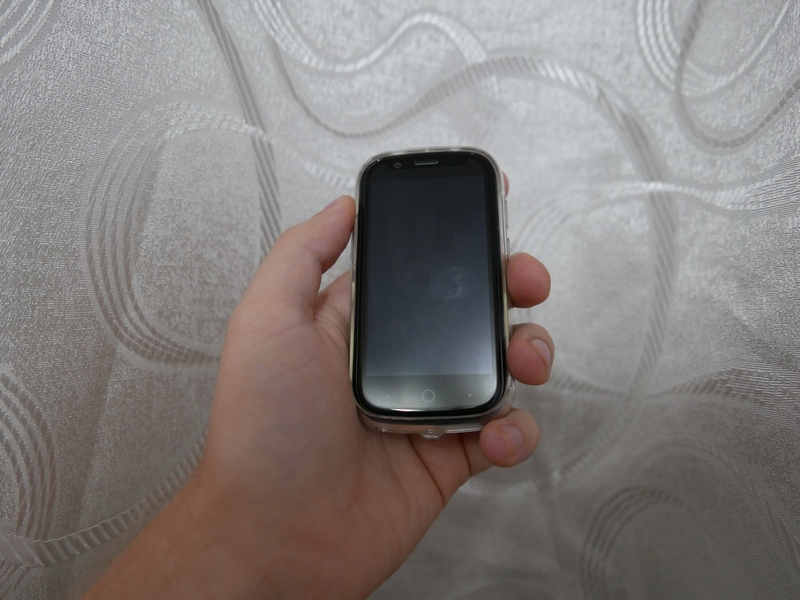

Сравним с другими компактными смартфонами. Каждую модель берём в топовой конфигурации. Добавим в сравнение также защищённые смартфоны Unihertz Atom и Servo S10 Pro.

<table>
<tr><th>Название</th><th>Unihertz Jelly 2</th><th>Unihertz Jelly Pro</th><th>Unihertz Atom</th><th>Soyes XS</th><th>Servo S10 Pro</th></tr>
<tr><td>RAM/ROM</td><td>6/128</td><td>3/32</td><td>4/64</td><td>3/32</td><td>3/64</td></tr>
<tr><td>Размер</td><td>95x49.4x16.5 мм</td><td>92.4x43x13 мм</td><td>96,6x45x18,8 мм</td><td>91x47x9,8 мм</td><td>97.8x51.4x15.5 мм</td></tr>
<tr><td>Процессор</td><td>MediaTek Helio P60</td><td>МТ6737</td><td>MediaTek Helio P23</td><td>MT6737</td><td>MT6737</td></tr>
<tr><td>ОС</td><td>Android 10</td><td>Android 8.1</td><td>Android 9.0 Pie</td><td>Android 6</td><td>Android 6</td></tr>
<tr><td>Аккумулятор</td><td>2000 мАч</td><td>950 мАч</td><td>2000 мАч</td><td>1580 мАч</td><td>1800 мАч</td></tr>
<tr><td>Экран</td><td>3” 480x854</td><td>2.45” 240x432</td><td>2.45” 240x432</td><td>3”</td><td>3” 480x854</td></tr>
<tr><td>Камера</td><td>16MP AF/8MP FF</td><td>8MP AF/2MP FF, видео 1080p</td><td>16MP AF/8MP FF, видео 1080p</td><td>5MP/5MP</td><td>13 MP/5 MP</td></tr>
<tr><td>USB</td><td>USB Type-C</td><td>Micro USB</td><td>USB Type-</td><td>?</td><td>?</td></tr>
<tr><td>Связь</td><td>4G, Wifi5 2/5ГГц, Bluetooth 4.2, NFC</td><td>4G, Wifi4 2/5ГГц, Bluetooth 4.0</td><td>4G, Wifi5 2/5ГГц, Bluetooth 4.1, NFC, рация</td><td>4G, Wifi4, Bluetooth?</td><td>4G, Wifi?, Bluetooth?, NFC, рация</td></tr>
<tr><td>SIM, microSD</td><td colspan="3">2x nanoSim, microsdxc (до 256 ГБ)</td><td>2x nanoSim, microsdxc (до 64 ГБ)</td><td>2x nanoSim, microsd?</td></tr>
<tr><td>Цена (на конец 08.2021)</td><td>15 650,23 руб.</td><td>8 779,40 руб.</td><td>18 197,79 руб.</td><td>8 015,21 руб.</td><td>9 771,85 руб.</td></tr>
</table>

Как видим, данный смартфон обладает наиболее актуальными характеристиками среди своих соперников.

## Распаковка

Перейдём к распаковке смартфона. Смартфон поставляется в небольшой квадратной коробке. В комплекте к смартфону ремешок, инструкция и зарядка на 1.5 А с кабелем. На смартфоне уже есть чехол и защитная плёнка, ещё одна защитная плёнка вместе с инструкцией спрятана в квадратный конверт.

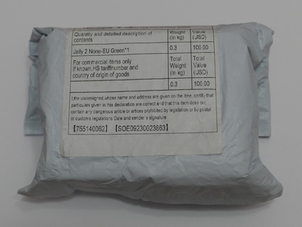
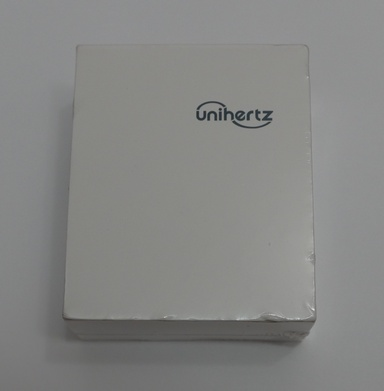
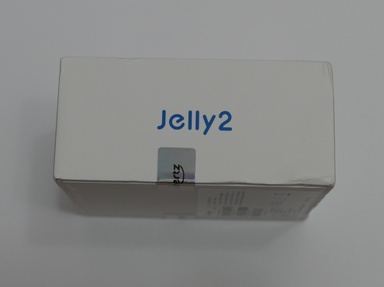
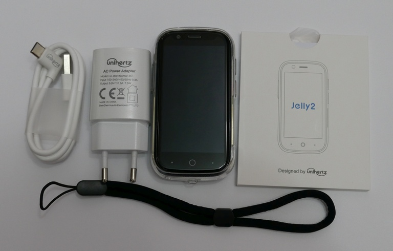
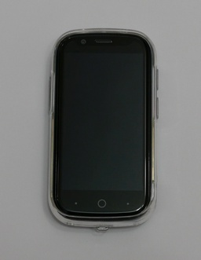
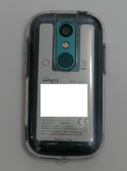
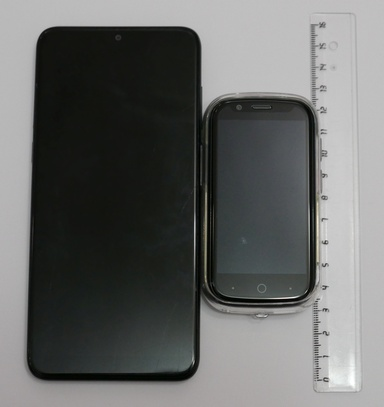
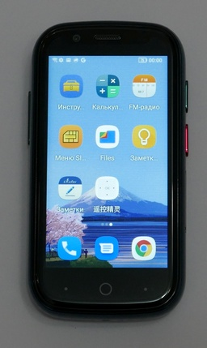
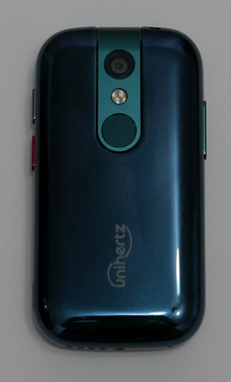

## Приложения и возможности

Экран устройства достаточно яркий. Проблем с читаемостью не возникает, всё довольно крупно. Клавиатурой на удивление удобно пользоваться для такой диагонали. Всё-таки даже по сравнению со смартфонами десятилетней давности Jelly 2 слишком компактный.

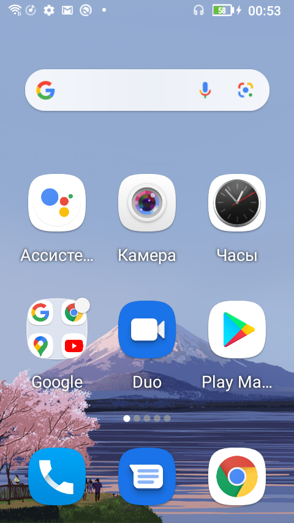

На смартфоне имеется программируемая кнопка. Если зажать её на несколько секунд, включается вспышка. Двукратное нажатие делает снимок экрана.

Лоток сим-карты рассчитан на две nanosim или одну nanosim и microsd.

Из предустановленных приложений кроме стандартных для Android 10 есть TrackBack, SOS, NFC Card List (хранилище NFC карт), Student mode и ZaZa remote (приложение для управления ИК-передатчиком). Также имеется приложение Инструменты.

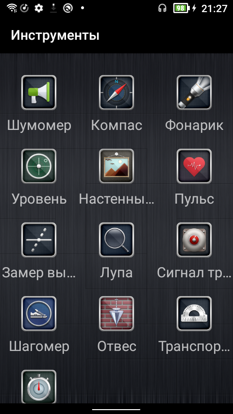

## Подключение к ПК

При подключении к компьютеру доступны опции: Передача файлов, USB-модем, MIDI, PTP и без передачи данных. Версия USB при подключении комплектным кабелем — 2.0. Для использования 3.0 надо подключать через кабель USB Type-C-USB Type-C или USB Type-A версии 3.0.

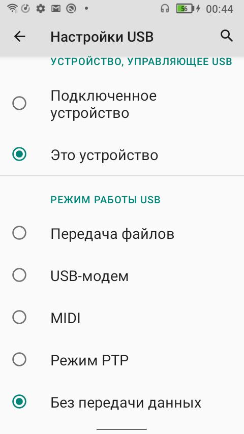

Скорость копирования данных комплектным кабелем 37 МБ/c, соответствует скорости USB 2.0. При использования кабеля версии 3.0 скорость составляет всё те же 37 МБ/с, хотя Windows определяет устройство как USB 3.0. Изначально пользователю доступно 111 ГБ внутренней памяти.

## Камера

Фотокамера здесь на уровне бюджетных телефонов, при 100% масштабе сильно заметна работа шумодава. Ночью снимки сильно размыты. В меню камеры имеется три режима: таймлапс, видео и фото. У задней камеры также имеется режим pro, в котором можно выбрать баланс белого, iso и экспозицию. Никаких дополнительных режимов вроде макро (естественно программного) или панорамы нет. 

По [ссылке](jelly2review_photos.html) представлены примеры фото.

## Тесты

Посмотрим, как справляется смартфон с популярными браузерными тестами. Тесты будем проводить в браузере Chrome.

<table>
<tr><td>Sunspider</td><td>978,5 мс</td></tr>
<tr><td>Jetstream2</td><td>30,624</td></tr>
<tr><td>Octane 2.0</td><td>10112</td></tr>
</table>

Это приблизительно в два раза быстрее чем intel atom z3735.

Перейдём к тестам PCMark.

<table>
<caption>Work 3.0</caption>
<tr><td>Общая</td><td>7156</td></tr>
<tr><td>Web browsing</td><td>5614</td></tr>
<tr><td>Video editing</td><td>5561</td></tr>
<tr><td>Writing</td><td>7501</td></tr>
<tr><td>Photo editing</td><td>14263</td></tr>
<tr><td>Data manipulation</td><td>5620</td></tr>
</table>

<table>
<caption>Storage 2.0</caption>
<tr><td>Общая</td><td>6197
<tr><td>Внутр. последовательное чтение</td><td>464,61 МБ/с</td></tr>
<tr><td>Внутр. произвольное чтение</td><td>31,94 МБ/с</td></tr>
<tr><td>Внутр. последовательная запись</td><td>142,29 МБ/с</td></tr>
<tr><td>Внутр. произвольная запись</td><td>7,63 МБ/с</td></tr>
<tr><td>Чтение SQLite</td><td>1748 IOPS</td></tr>
<tr><td>Обновление SQLite</td><td>236 IOPS</td></tr>
<tr><td>Вставка SQLite</td><td>153 IOPS</td></tr>
<tr><td>Удаление SQLite</td><td>229 IOPS</td></tr>
</table>

Теперь посмотрим на результаты тестов 3dmark.

<table>
<tr><th></th><th>Общая</th><th>Graphics</th><th>Physics</th></tr>
<tr><td>Sling Shot</td><td>1691</td><td>1554</td><td>2445</td></tr>
<tr><td>Sling Shot Extreme</td><td>1298</td><td>1142</td><td>2493</td></tr>
<tr><td>Wild Life</td><td>644</td><td></td><td></td></tr>
<tr><td>Wild Life Extreme</td><td>174</td><td></td><td></td></tr>
</table>

Во время тестов смартфон ощутимо нагревался с задней стороны.

### Проигрывание видео и аудио

Посмотрим как телефон справляется с проигрыванием видео. При просмотре youtube видео с разрешением до 1440p60 выводится плавно, с 2160p60 уже заметны притормаживания.

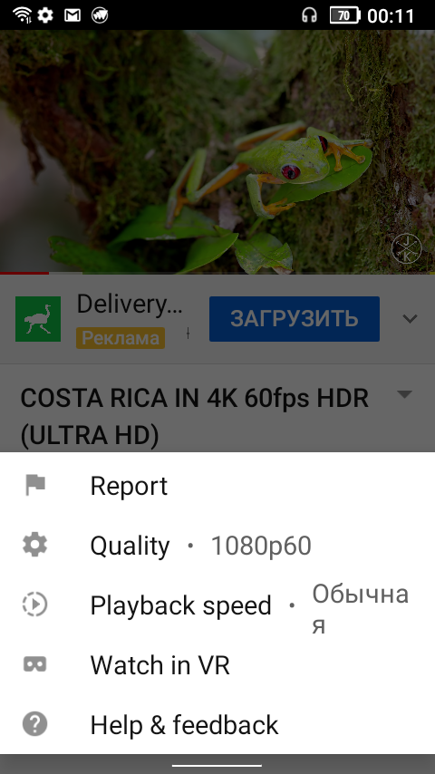

Видео h264 1080p24 также воспроизвелось без проблем как MX Player, так и стандартным плеером. При воспроизведении видео h264 2160p25 были заметные подёргивания. Аудиодорожки AC-3 стандартным плеером не воиспроизводятся. Видео VC1 (используется в некоторых blueray) воспроизводилось MX Player программно, были заметны небольшие подёргивания, стандартный плеер файл не открыл. Видео h264 high 10, так любимое анимешниками, воспроизвелось без нареканий, но только в MX Player и опять же программно.

При проигрывании музыки заметен едва различимый шум. Для аудиофилов можно порекомендовать разве что купить внешний ЦАП. К сожалению, мне не удалось вывести звук через имеющийся у меня переходник USB Type-C.

### Батарея

Перейдём к тестам автономной работы. Все тесты проходили при яркости экрана 50%.

<table>
<tr><td>Видео (MXPlayer, 1080p h264)</td><td>7 ч 53 мин</td></tr>
<tr><td>Яндекс.музыка</td><td>28 ч 45 мин</td></tr>
<tr><td>PCMark Work 3.0 Battery Life</td><td>6 ч 2мин</td></tr>
</table>

Следует также заметить, что при низком заряде батареи загорается красный светодиод рядом с фронтальной камерой.

Смартфон заряжается от комплектной зарядки напряжением 5.2 В и силой тока 1.23 А. Полностью заряжается за час пятьдесят минут, напряжение опускается до 5 В.

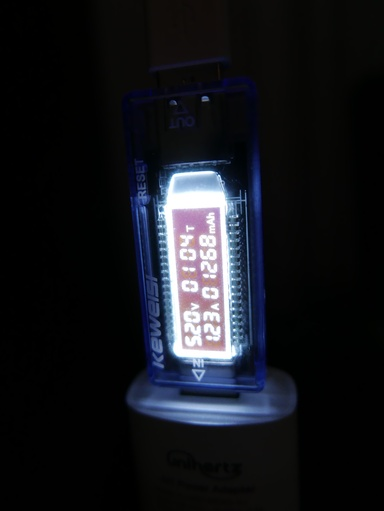

## Выводы

Подведём итоги. У unihertz получился ультракомпактный смартфон, которым действительно удобно пользоваться. Из плюсов можно отметить более-менее актуальную платформу, которая лучше, чем у конкурирующих моделей, и продолжительное время автономной работы. Из минусов — слабую камеру и посредственный звук через наушники.
